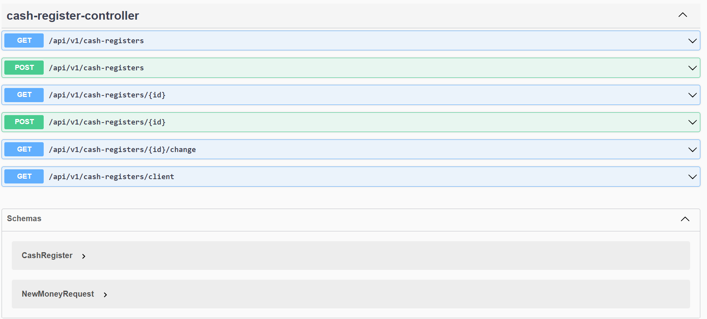

# Transaction Hub
Transaction Hub is an application designed to manage transactions, and their owners, securely in a centralized manner.

## Table of Contents

1. [Introduction](#introduction)
2. [Features](#features)
3. [Technologies Used](#technologies-used)
4. [Usage](#usage)
5. [Development](#Development)

# Introduction
Transaction Hub aims to streamline transactional processes within a system by providing a centralized platform for managing and grouping transactions. It offers features such as transaction creation, monitoring, enhancing the efficiency and reliability of transactional workflows.

# Features
System Managment: See all transactional system sub-groups (here called cash registers), create sub-groups, see them by id, update them.\
Transaction Management: Create and update transactions.\
Security: Ensure secure access to transactional data through authentication and authorization (admin and user accounts).\
Scalability: Designed to handle a large volume of transactions efficiently.\
Integration: Seamlessly integrates with other systems through RESTful APIs.

# Technologies Used 
Java 20, Spring, Spring Boot 3, JUnit, PostgresSQL, Liquibase, Docker, Project Loombok, Git, Github, H2 Database (temporaily for tests)

# Usage
After cloning the project, open it in the IDE of your choice and install all the dependencies. 
This app requires a local database, you can quickly set one up with a docker command.
```docker run --name my-postgres -e POSTGRES_PASSWORD=postgres -e POSTGRES_USER=postgres -e POSTGRES_DB=cash_register -p 5436:5432 -d postgres```

After running the application you can access all the endpoints here 
```http://localhost:8080/swagger-ui/index.html#/```


Code reviews provided by: Karol Latos
